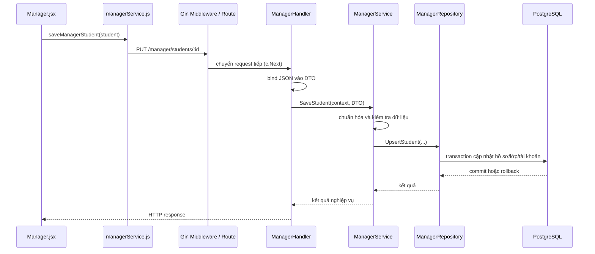

# Các mẫu thiết kế trong đồ án Rèn Luyện DLU

## 1. Mục tiêu và phạm vi

Rèn Luyện DLU được xây dựng bằng React, Go (Gin, GORM) và PostgreSQL. Qua cấu trúc mã nguồn hiện tại, đồ án thể hiện rõ nhất các mẫu kiến trúc ứng dụng gồm **Layered Architecture**, **Repository**, **Service Layer**, **Dependency Injection** và **Data Transfer Object (DTO)**. Ở tầng HTTP, chuỗi middleware của Gin thể hiện **Chain of Responsibility**.

Điểm cần trình bày chính xác khi báo cáo: không phải mọi cấu trúc có tên giống một mẫu đều là mẫu GoF. Chain of Responsibility là mẫu hành vi thuộc nhóm GoF. Repository, Service Layer và DTO thường được xếp vào mẫu kiến trúc ứng dụng/enterprise; Dependency Injection là kỹ thuật thiết kế và tổ chức phụ thuộc. Các mẫu này vẫn có giá trị thực tế, nhưng nên phân biệt nhóm để tránh gọi tất cả là “mẫu GoF”.

## 2. Layered Architecture (Kiến trúc phân lớp)

### Khái niệm và ứng dụng

Layered Architecture chia hệ thống thành các tầng có nhiệm vụ riêng. Một tầng cung cấp dịch vụ cho tầng phía trên và sử dụng dịch vụ của tầng phía dưới. Đồ án tổ chức backend theo luồng chính:

```text
HTTP Request
    -> Route / Middleware
    -> Handler
    -> Service
    -> Repository
    -> PostgreSQL
```

Frontend cũng có sự phân tách tương ứng giữa trang/component giao diện và các hàm gọi API trong `services/`.

### Trường hợp sử dụng

- Ứng dụng web có nhiều chức năng, cần tách giao tiếp HTTP, nghiệp vụ và truy cập dữ liệu.
- Nhiều thành viên cùng phát triển các phần khác nhau mà vẫn cần ranh giới trách nhiệm rõ.
- Cần thay đổi giao diện API hoặc cách lưu trữ mà hạn chế ảnh hưởng đến các tầng còn lại.

### Ưu điểm

- Dễ tìm vị trí xử lý: nhận request ở handler, quy tắc nghiệp vụ ở service, SQL ở repository.
- Giảm việc trộn truy vấn dữ liệu vào xử lý HTTP hoặc giao diện.
- Có thể kiểm thử từng tầng tập trung hơn; service có thể nhận repository thông qua interface.
- Phù hợp với cấu trúc module quản lý sinh viên, lớp, tài khoản và vai trò.

### Nhược điểm

- Nếu một nghiệp vụ đơn giản phải đi qua quá nhiều tầng, mã nguồn có thể dài hơn mức cần thiết.
- Nếu các tầng chỉ chuyển tiếp dữ liệu mà không có trách nhiệm cụ thể, kiến trúc dễ trở thành nhiều lớp hình thức.
- Thay đổi hợp đồng DTO giữa các tầng cần được phối hợp cẩn thận.

### Ví dụ trong đồ án và kết quả

Khi quản trị viên lưu thông tin sinh viên, frontend gọi các hàm trong `frontend/src/services/managerService.js`. Request được ánh xạ tới route trong `backend/internal/routes/routes_manager.go`, sau đó `ManagerHandler` đọc dữ liệu JSON và gọi `ManagerService`. Service chuẩn hóa và kiểm tra trường bắt buộc, còn repository thực hiện thao tác PostgreSQL.

Kết quả là từng phần có phạm vi tương đối rõ: handler không cần viết SQL, service không cần tạo HTTP response, và giao diện không cần biết chi tiết câu lệnh cơ sở dữ liệu. Các vị trí cụ thể được minh họa ở [routes_manager.go](../backend/internal/routes/routes_manager.go), [manager_handler.go](../backend/internal/handler/manager_handler.go), [manager_service.go](../backend/internal/service/manager_service.go) và [manager_repository.go](../backend/internal/repository/manager_repository.go).

## 3. Repository Pattern

### Khái niệm và ứng dụng

Repository cung cấp một cổng truy cập dữ liệu thông qua các thao tác có ý nghĩa với miền nghiệp vụ. Service gọi các hàm như `GetAccounts`, `UpsertStudent` hoặc `DeleteClass` thay vì tự xây dựng truy vấn SQL. Trong đồ án, `ManagerRepository` là interface và `managerRepository` là implementation dùng GORM/PostgreSQL.

### Trường hợp sử dụng

- Nghiệp vụ cần đọc/ghi nhiều bảng hoặc có truy vấn phức tạp.
- Muốn cô lập chi tiết ORM, SQL, join và transaction khỏi tầng nghiệp vụ.
- Muốn thay repository thật bằng fake/mock trong kiểm thử service.

### Ưu điểm

- Tập trung truy vấn dữ liệu, dễ rà soát và bảo trì hơn việc rải SQL trong handler.
- Service phụ thuộc vào interface `ManagerRepository`, không phải trực tiếp vào struct truy cập DB.
- Có thể gom nhiều thao tác dữ liệu liên quan vào cùng một hàm repository, ví dụ lưu sinh viên và đồng bộ tài khoản.

### Nhược điểm

- Interface và hàm trung gian làm tăng số lượng mã nguồn.
- Nếu mỗi truy vấn đơn giản đều bị bọc máy móc, repository có thể trở thành lớp chuyển tiếp không đem lại lợi ích.
- Repository không tự thay thế transaction hay quy tắc nghiệp vụ; các ranh giới đó vẫn phải thiết kế rõ.

### Ví dụ trong đồ án và kết quả

Trong [manager_repository.go](../backend/internal/repository/manager_repository.go), các hàm lấy danh sách sinh viên, lớp, tài khoản và vai trò chịu trách nhiệm truy vấn PostgreSQL. Hàm `UpsertStudent` dùng transaction để lưu/cập nhật hồ sơ sinh viên, cập nhật thông tin lớp nếu cần và tạo hoặc đồng bộ tài khoản người dùng liên kết.

Kết quả là logic SQL được tập trung tại repository; nếu một bước trong transaction thất bại, GORM sẽ rollback thay vì để hồ sơ và tài khoản ở trạng thái cập nhật dở dang. Cơ chế transaction này là thuộc tính đảm bảo tính toàn vẹn dữ liệu, không phải một mẫu GoF riêng.

## 4. Service Layer

### Khái niệm và ứng dụng

Service Layer định nghĩa các thao tác nghiệp vụ mà ứng dụng cung cấp. Service tiếp nhận dữ liệu đã được handler giải mã, áp dụng quy tắc và gọi repository để đọc/ghi dữ liệu. Nó tạo một ranh giới giữa giao thức HTTP và nghiệp vụ của hệ thống.

### Trường hợp sử dụng

- Một thao tác cần nhiều bước, kiểm tra điều kiện hoặc biến đổi dữ liệu.
- Quy tắc nghiệp vụ cần được gọi từ nhiều handler hoặc nhiều loại giao diện.
- Muốn kiểm thử quy tắc mà không khởi chạy Gin hoặc phụ thuộc trực tiếp vào PostgreSQL.

### Ưu điểm

- Quy tắc nghiệp vụ không bị gắn chặt với chi tiết HTTP.
- Có vị trí rõ ràng để chuẩn hóa dữ liệu, kiểm tra điều kiện và xử lý các bước trước khi lưu.
- Tăng khả năng tái sử dụng và kiểm thử so với đặt toàn bộ logic trong handler.

### Nhược điểm

- Service có thể phình to nếu gom quá nhiều nghiệp vụ không liên quan vào một struct.
- Cần tránh lặp cùng một quy tắc giữa service và frontend; kiểm tra bảo vệ dữ liệu phải được thực thi ở backend.
- Nếu chỉ chuyển tiếp mọi lời gọi đến repository thì service chưa tạo ra nhiều giá trị.

### Ví dụ trong đồ án và kết quả

Trong [manager_service.go](../backend/internal/service/manager_service.go), `SaveAccount` chuẩn hóa tên, email, mã vai trò và mã lớp; kiểm tra các trường bắt buộc; tạo password hash bằng bcrypt trước khi gọi repository. `SaveStudent` chuẩn hóa mã sinh viên, email, lớp và các trường địa chỉ, sau đó yêu cầu repository lưu dữ liệu.

Kết quả là các quy tắc này được xử lý trước khi truy cập DB, còn handler tập trung vào bind request và trả HTTP response. Điều này giúp giảm nguy cơ lưu dữ liệu chưa chuẩn hóa và khiến luồng nghiệp vụ dễ đọc hơn.

## 5. Dependency Injection (DI - Tiêm phụ thuộc)

### Khái niệm và ứng dụng

Dependency Injection là cách cung cấp các phụ thuộc từ bên ngoài cho một đối tượng thay vì để đối tượng tự tạo mọi thứ bên trong. Đây là kỹ thuật thiết kế, không phải một mẫu GoF độc lập. Đồ án sử dụng constructor injection: route tạo repository, truyền repository vào service, rồi truyền service vào handler.

```text
*gorm.DB -> ManagerRepository -> ManagerService -> ManagerHandler
```

Các interface `ManagerRepository` và `ManagerService` giúp thể hiện hợp đồng giữa các thành phần. Việc lắp các implementation hiện tại được thực hiện tại [routes_manager.go](../backend/internal/routes/routes_manager.go).

### Trường hợp sử dụng

- Một thành phần cần database, service khác hoặc client bên ngoài.
- Cần thay implementation thật bằng implementation giả trong test.
- Muốn nhìn thấy rõ nơi khởi tạo và cấu hình đồ thị phụ thuộc của ứng dụng.

### Ưu điểm

- Giảm phụ thuộc trực tiếp giữa handler, service và implementation lưu trữ.
- Dễ thay thế hoặc giả lập repository trong kiểm thử.
- Việc khởi tạo tập trung giúp luồng phụ thuộc của module dễ quan sát.

### Nhược điểm

- Có thêm interface và constructor nên cần duy trì hợp đồng giữa các tầng.
- Nếu dependency graph lớn mà không có quy ước quản lý, việc khởi tạo thủ công có thể dài.
- DI chỉ làm lỏng kết nối; nó không tự bảo đảm nghiệp vụ đúng hoặc test đã đầy đủ.

### Ví dụ trong đồ án và kết quả

`MapManagerRoutes` gọi `NewManagerRepository(db)`, truyền kết quả vào `NewManagerService`, rồi truyền service vào `NewManagerHandler`. Handler không tự mở kết nối DB; service không tự tạo repository cụ thể trong các phương thức nghiệp vụ.

Kết quả là thay đổi implementation repository có thể được giới hạn ở điểm khởi tạo và các hợp đồng liên quan, thay vì sửa từng endpoint. Đây là nền tảng thuận lợi cho unit test; hiện phần mã được khảo sát thể hiện khả năng tiêm phụ thuộc, không đồng nghĩa đã có bộ test dùng mock.

## 6. Chain of Responsibility (Chuỗi trách nhiệm)

### Khái niệm và ứng dụng

Chain of Responsibility là mẫu hành vi GoF: một request đi qua chuỗi handler; mỗi handler có thể xử lý, chặn, hoặc chuyển tiếp request cho thành phần tiếp theo. Middleware HTTP là cách ứng dụng phổ biến của ý tưởng này.

### Trường hợp sử dụng

- Cần áp dụng các xử lý chung như ghi log, kiểm tra quyền, CORS, giới hạn truy cập hoặc phục hồi lỗi trước endpoint.
- Cần bật/tắt hoặc sắp xếp các bước xử lý request theo cấu hình.
- Muốn endpoint tập trung vào nghiệp vụ riêng thay vì lặp lại xử lý xuyên suốt.

### Ưu điểm

- Tách xử lý dùng chung khỏi từng endpoint.
- Có thể kết thúc chuỗi sớm khi request không hợp lệ hoặc không cần đi tiếp.
- Có thể thêm middleware mà ít phải sửa mã handler nghiệp vụ.

### Nhược điểm

- Thứ tự middleware có thể làm thay đổi hành vi; cần cấu hình và kiểm thử thứ tự rõ.
- Nếu nhiều middleware cùng ghi/sửa response, luồng xử lý khó theo dõi.
- Việc truyền tiếp hoặc dừng chuỗi sai có thể khiến request không tới endpoint hoặc response bị xử lý thiếu.

### Ví dụ trong đồ án và kết quả

Trong [routes.go](../backend/internal/routes/routes.go), Gin đăng ký logger, recovery và middleware CORS. Middleware CORS thêm các header; request `OPTIONS` được trả `204` và dừng tại đó, request khác gọi `c.Next()` để tiếp tục đến handler phía sau.

Kết quả là các request được đi qua các bước xử lý chung trước endpoint; riêng preflight CORS được trả lời mà không cần mỗi route tự cài đặt. Trong phần mã này chưa thấy middleware xác thực được gắn vào chuỗi route quản lý, vì vậy không nên báo cáo rằng các endpoint này hiện đã được bảo vệ bằng authentication/authorization nếu chưa xác minh nơi khác.

## 7. Data Transfer Object (DTO)

### Khái niệm và ứng dụng

DTO là đối tượng dữ liệu dùng để truyền thông tin giữa các ranh giới của ứng dụng, thường giữa HTTP handler, service và repository. DTO có thể được thiết kế riêng cho dữ liệu truy vấn và dữ liệu mutation, tránh để tầng API phụ thuộc trực tiếp vào cấu trúc bảng database.

### Trường hợp sử dụng

- Request và response API cần cấu trúc khác với entity hoặc bảng lưu trữ.
- Cần kiểm soát trường nào được nhận vào khi tạo/cập nhật.
- Cần truyền một tập trường đã tổng hợp từ nhiều bảng tới giao diện.

### Ưu điểm

- Hợp đồng API rõ ràng và có thể thay đổi độc lập tương đối với schema database.
- Hạn chế việc vô tình trả các trường nội bộ không dành cho client.
- Dễ biểu diễn kết quả tổng hợp từ join hoặc query projection.

### Nhược điểm

- Có thể phát sinh nhiều cấu trúc và mã ánh xạ giữa DTO với dữ liệu lưu trữ.
- Nếu DTO được dùng chung mọi nơi, ranh giới giữa request, response và dữ liệu nội bộ lại bị mờ.
- DTO chỉ là cấu trúc dữ liệu; việc kiểm tra hợp lệ vẫn cần được thực hiện ở tầng phù hợp.

### Ví dụ trong đồ án và kết quả

Các kiểu trong [manager_dto.go](../backend/internal/dto/manager_dto.go), chẳng hạn dữ liệu truy vấn sinh viên/tài khoản và mutation sinh viên/tài khoản, được handler bind từ request hoặc trả về service/repository. Repository có thể chiếu dữ liệu từ nhiều bảng vào một DTO danh sách mà không bắt buộc frontend phải hiểu cấu trúc SQL.

Kết quả là hợp đồng request/response được thể hiện bằng kiểu dữ liệu Go và tách khỏi cách truy vấn DB. Khi thay đổi API, có thể đánh giá và cập nhật DTO mà không nhất thiết phải đổi trực tiếp mọi bảng lưu trữ.

## 8. Luồng áp dụng tổng hợp

Ví dụ: quản trị viên sửa hồ sơ sinh viên và hệ thống đồng bộ tài khoản liên kết.



Luồng này cho thấy các mẫu hỗ trợ lẫn nhau: phân lớp xác định vị trí từng trách nhiệm; DTO mang dữ liệu qua ranh giới; service thực hiện nghiệp vụ; repository thao tác dữ liệu; DI nối các thành phần; middleware xử lý request xuyên suốt trước endpoint.

## 9. Kết luận dùng trong phần trình bày

Đồ án áp dụng thiết kế theo hướng phân lớp ở backend, kết hợp Service Layer và Repository để tách nghiệp vụ khỏi truy cập PostgreSQL. Dependency Injection được dùng để nối repository, service và handler thông qua constructor/interface. DTO tạo hợp đồng dữ liệu giữa API và các tầng xử lý. Ở tầng HTTP, Gin middleware thể hiện Chain of Responsibility khi request được xử lý theo chuỗi và có thể tiếp tục hoặc dừng sớm.

Những lựa chọn này giúp mã nguồn dễ phân chia, bảo trì và mở rộng các chức năng quản lý sinh viên, lớp và tài khoản. Tuy nhiên, đây không phải tất cả đều là GoF: chỉ Chain of Responsibility trong danh sách trên là mẫu GoF cổ điển; các mẫu còn lại thuộc kiến trúc ứng dụng hoặc là kỹ thuật thiết kế. Báo cáo nên nêu rõ phân loại này và tránh khẳng định các cơ chế chưa được thấy trong code, chẳng hạn xác thực middleware cho nhóm route quản lý.
